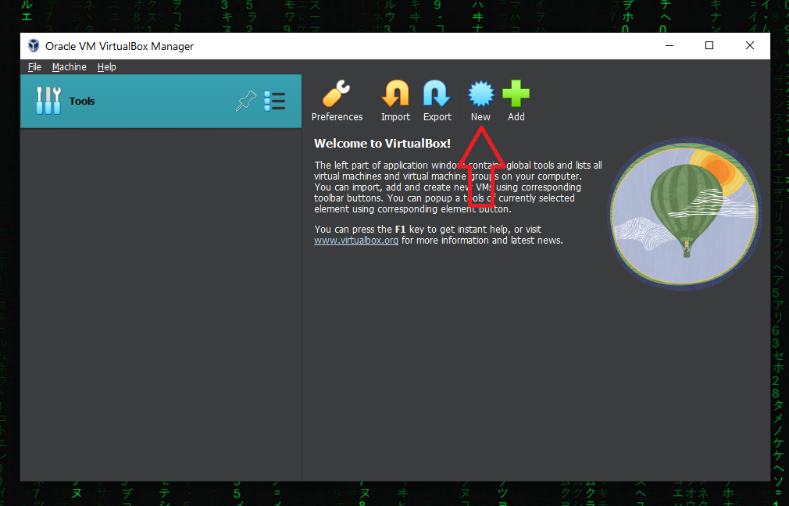
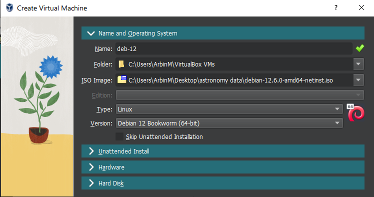
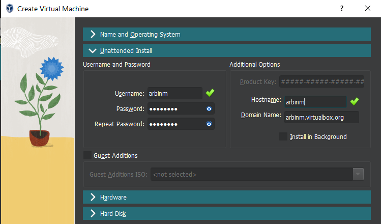
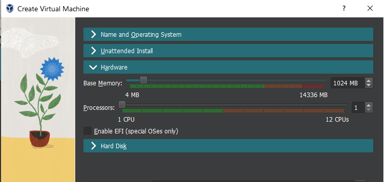
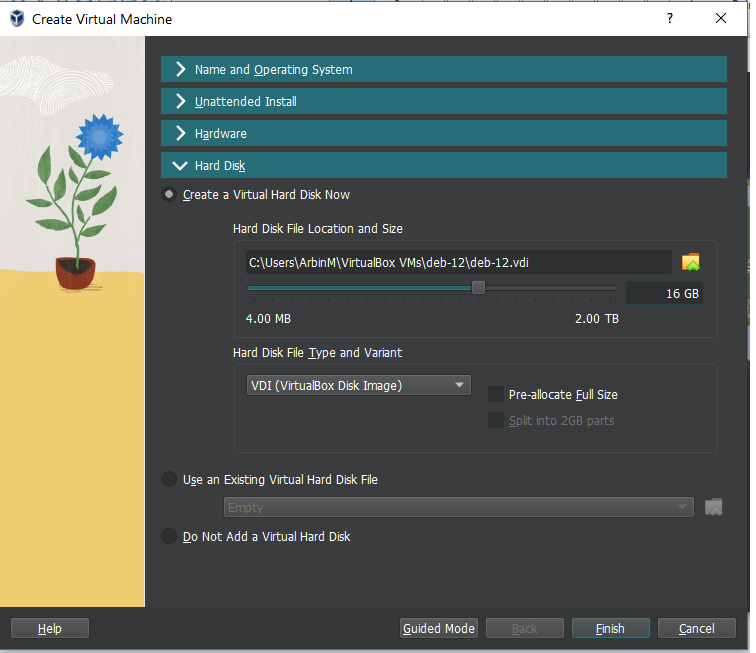
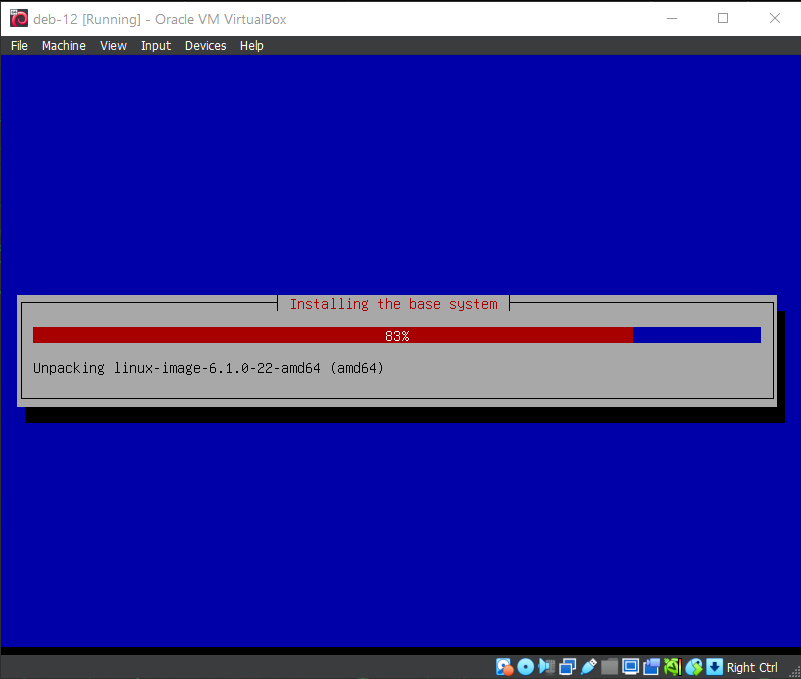
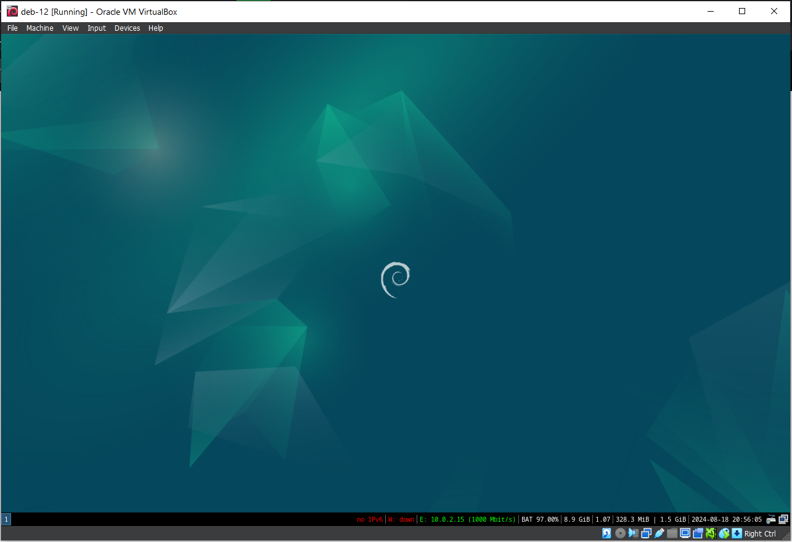

## Learning About Virtualization, Hypervisor, Linux Concepts

## Setting Up a VM

1. Downloaded Debian 12 (bookworm) netinstaller
2. Download Oracle Vbox.
3. New VM    
   

4. Setting Up -> Selecting name, Operating System iso file   
   
 
5. Setting Up -> User account, host and domain name    
    

6. Setting Up -> Hardware Allocation     
    

7. Setting Up -> Storage allocation    
    

8. Unattended install    
    

9. Modifying OS (replacing gnome with i3wm for memory constraints and removing unecessary software libreoffice, file manager, etc.)    

```
apt-get list --installed | grep -i "gnome"
sudo apt-get remove $(apt list --installed "gnome*" 2>/dev/null | awk -F'/' 'NR>1{print $1}')
sudo apt install lightdm i3wm
sudo systemctl enable lightdm.service
sudo apt remove libreoffice
```

 

