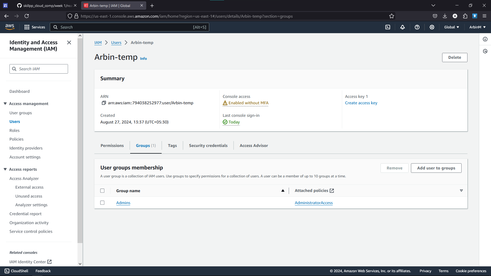

# WEEK 1 : Understanding AWS and Creating an AWS account

1. Create a free-tier account      
     
2. 
3. Adding a new User     

4. Creating a new Group    

5. Adding permissions to the group      

6. finalizing the user      

7. Logging into the user    

