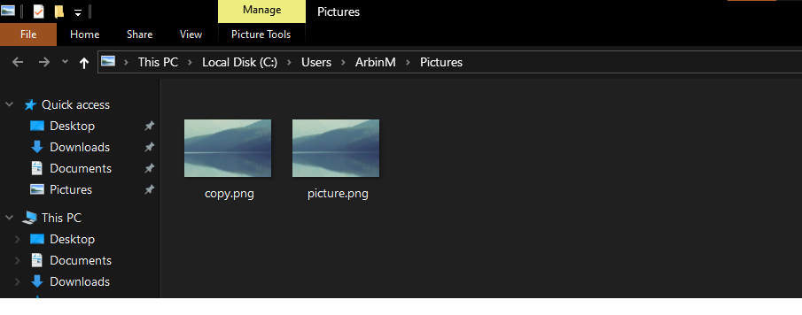

<<<<<<< HEAD
# WEEK 2 : Working with Buckets and AWS S3 SDK

### TASK 1: Creating a Bucket:
1. Logging into IAM Account
2. Creating access keys     

4. Changing Server to asia-mumbai. (closest)
5. creating a bucket with unique name       
   

### TASK 2: Using Amazon SDK to uload and download Objects
4. Uploading [this](https://images.ctfassets.net/hrltx12pl8hq/4f6DfV5DbqaQUSw0uo0mWi/6fbcf889bdef65c5b92ffee86b13fc44/shutterstock_376532611.jpg?fit=fill&w=600&h=400) image to bucket using python SDK code.    

 ```
import logging
import boto3
from botocore.exceptions import ClientError
import os
def upload_file(path, bucket, object_name=None):
        # If S3 object_name was not specified, use file_name
        if object_name is None:
            object_name = os.path.basename(file_name)
        # Upload the file
        s3_client = boto3.client('s3')
        try:
            response = s3_client.upload_file(file_name, bucket, object_name)
        except ClientError as e:
            logging.error(e)
            return False
        return True
```
      


5. Downloading the image from the bucket using this code        
```
def download_file(bucket, object, path):
    s3 = boto3.client('s3')
    s3.download_file(bucket, object, path)
```      
     
    

### TASK 3: Hosting a static website on AWS
6. Uploading the files to Bucket   

7. Making the file public via ACL       

=======
# WEEK 2 : Working with Buckets and AWS S3 SDK

### TASK 1: Creating a Bucket:
1. Logging into IAM Account
2. Creating access keys     

4. Changing Server to asia-mumbai. (closest)
5. creating a bucket with unique name       
   

4. Uploading [this](https://images.ctfassets.net/hrltx12pl8hq/4f6DfV5DbqaQUSw0uo0mWi/6fbcf889bdef65c5b92ffee86b13fc44/shutterstock_376532611.jpg?fit=fill&w=600&h=400) image to bucket using python SDK code.    

 ```
import logging
import boto3
from botocore.exceptions import ClientError
import os
def upload_file(path, bucket, object_name=None):
        # If S3 object_name was not specified, use file_name
        if object_name is None:
            object_name = os.path.basename(file_name)
        # Upload the file
        s3_client = boto3.client('s3')
        try:
            response = s3_client.upload_file(file_name, bucket, object_name)
        except ClientError as e:
            logging.error(e)
            return False
        return True
```
      


5. Downloading the image from the bucket using this code        
```
def download_file(bucket, object, path):
    s3 = boto3.client('s3')
    s3.download_file(bucket, object, path)
```      
     
    

>>>>>>> a2d7ac36248481275f279f901bb05bd763850e07
