# WEEK3: TASK 2: CREATE A VPC NETWORK
 - Navigate to Create VPC Network    
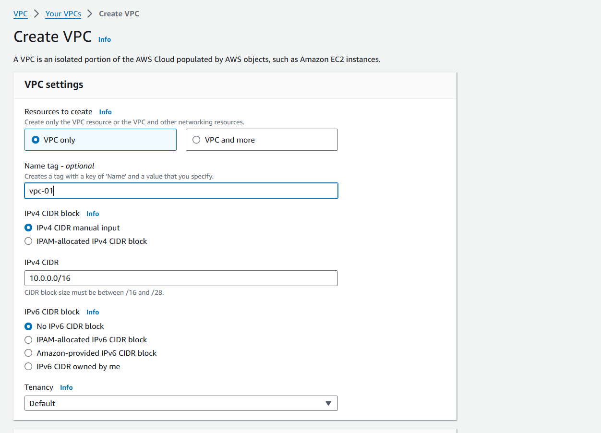
1. Create VPC Network with default settings and appropriate CIDR     
2. Create a Subnet        
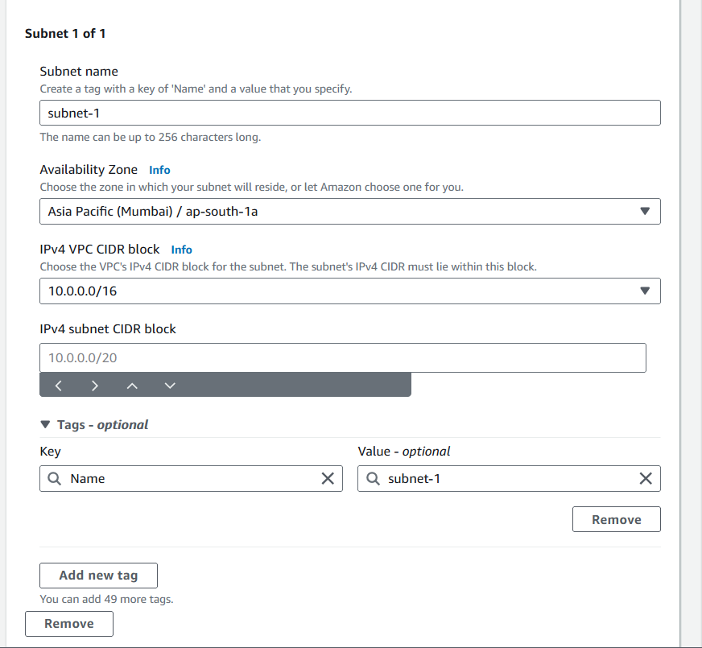
3. Create 5 more Subnets     
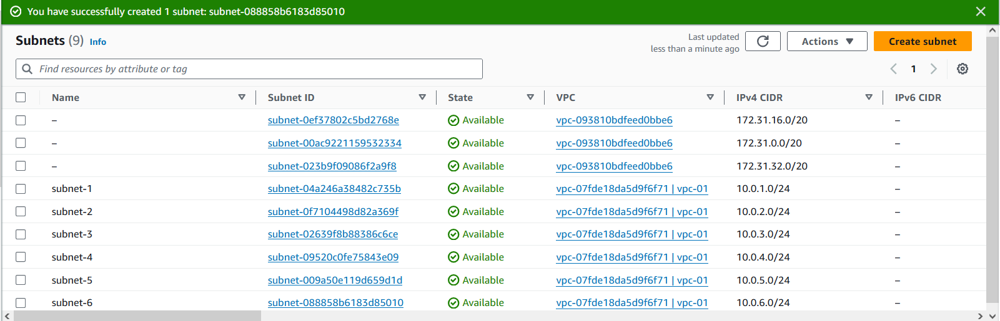
4. Assign Public IP's to the public subnet      
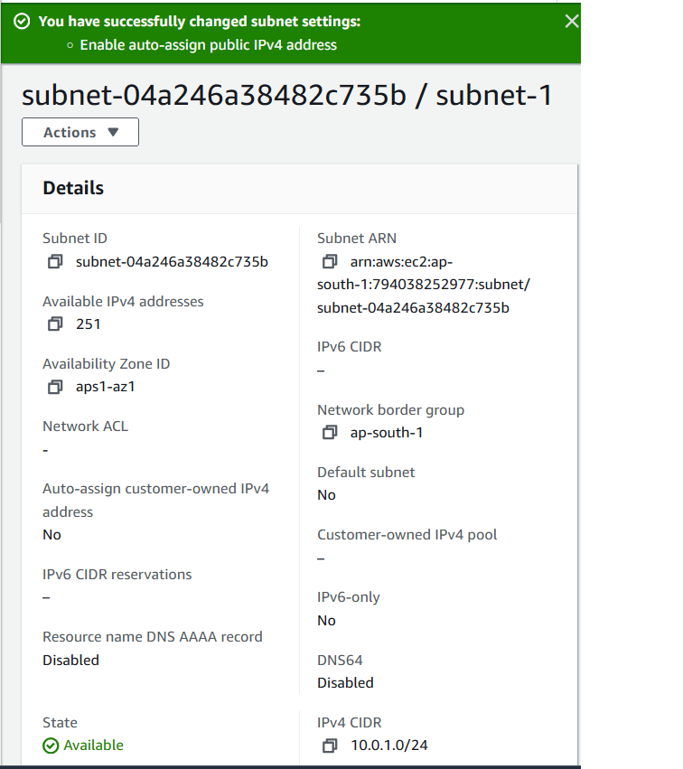
5. create 2 Routing Tables one for Public and one for Private Subnets       
6. assign public Subnets to routing table      
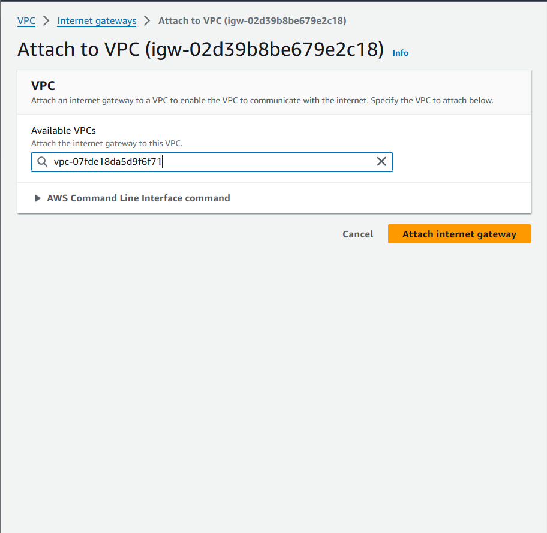 
8. create an internet gateway      
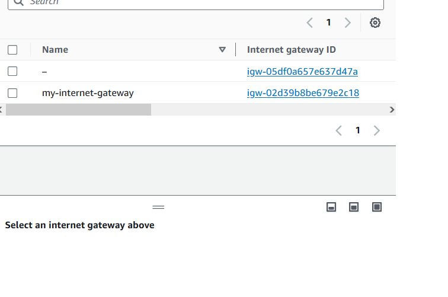
9. Create a NAT Gateway       
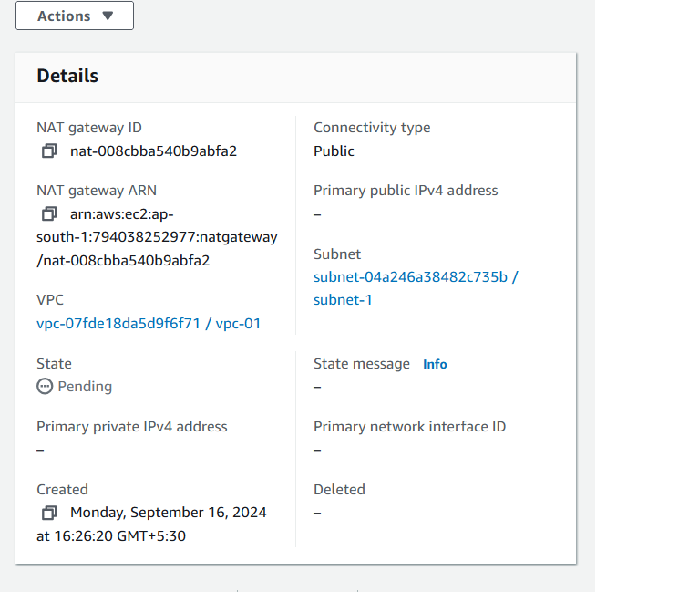
10. associate the edge device to the public Subnet        
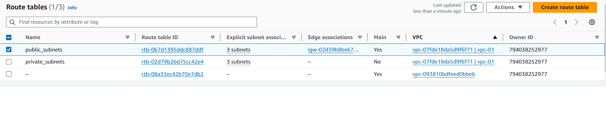         

Subnets associated to internet gateway are public subnets and those not connected are private subnets.

## ALTERNATIVE
1. Select VPC and more option  in Create VPC Networks        
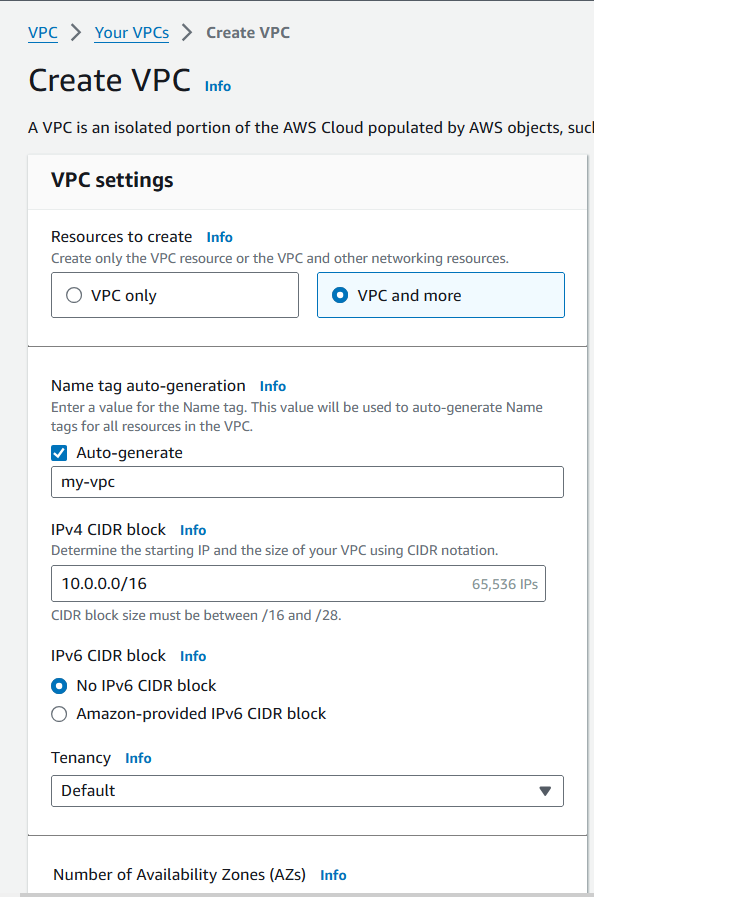
2. Select 3 Availability Zones        
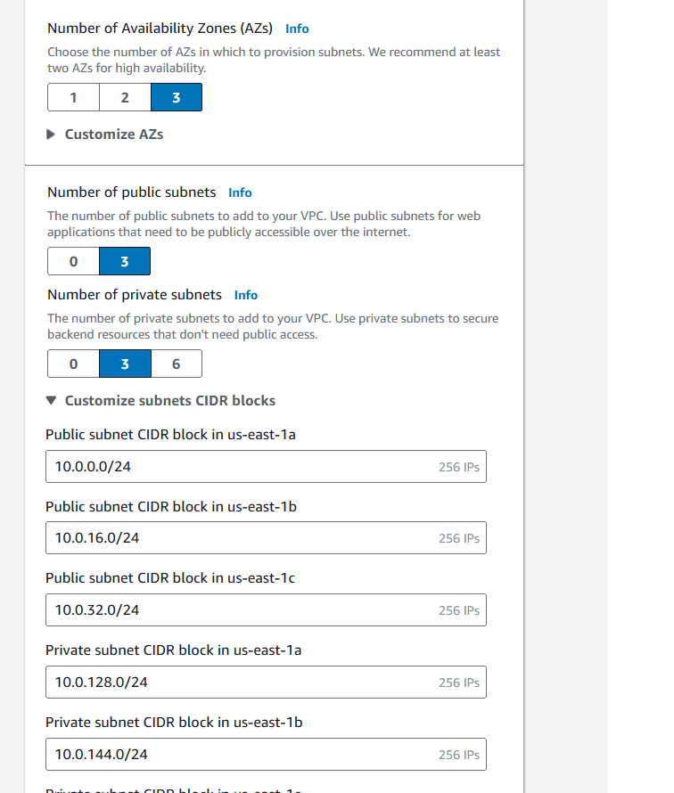
3. Select 3 Public and 3 Private Subnets        
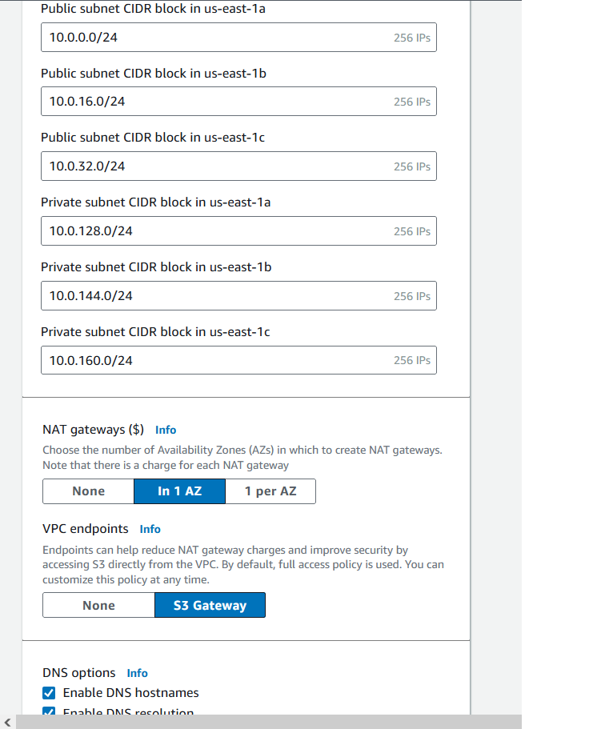
4. Set 1 NAT Gateway        
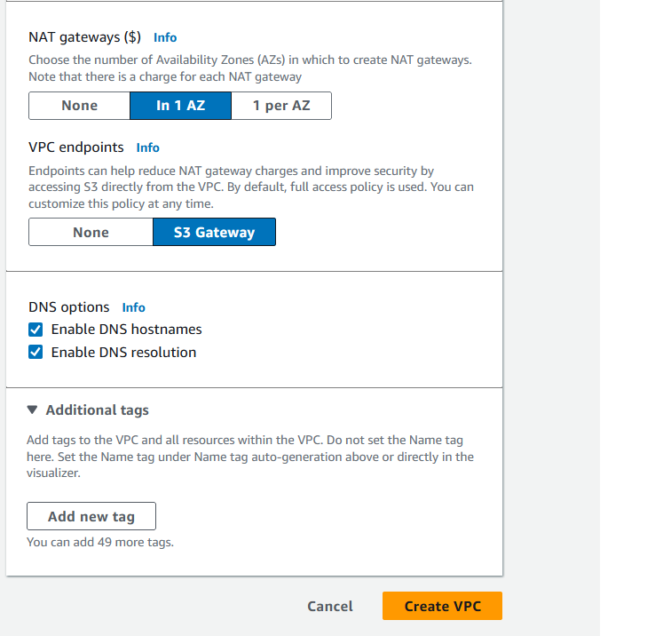
5. Select S3 Gateway       
7. Create VPC        
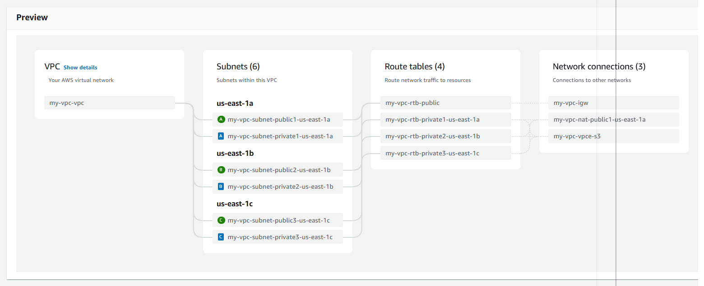

# WEEK3: TASK 4: HOST A EC2 INSTANCE IN PUBLIC SUBNET
1. Navigate to Launch an EC2 instance     
2. Name the Instance      
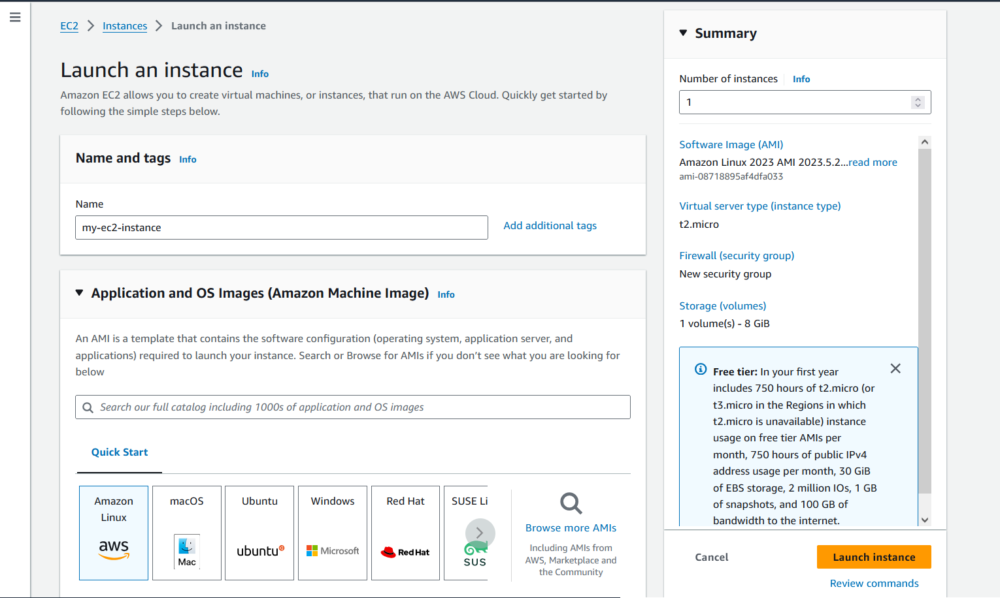
3. Select the OS Image (Amazon Linux for free tier with ssd)      
4. Select the Instance Type (T2.micro for free tier)      
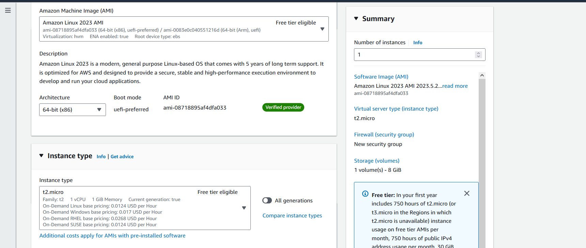
5. Select the new VPC network created       
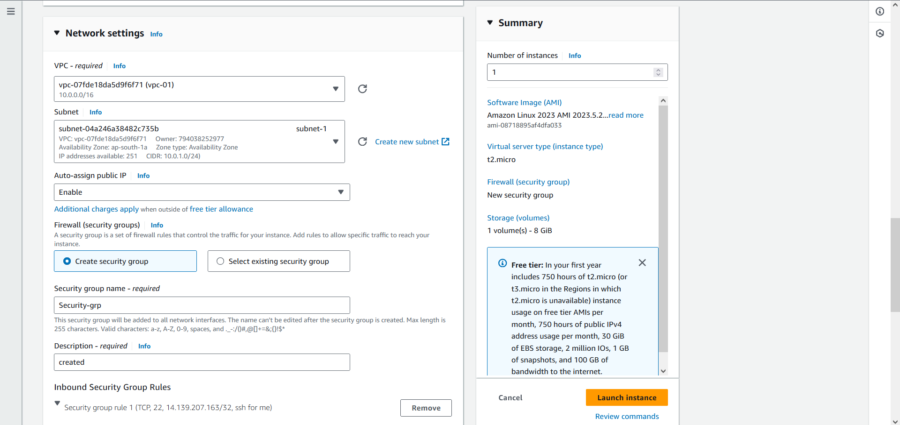
6. Select any public subnet      
7. Configure Security Group       
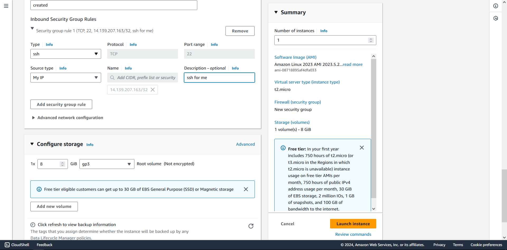
8. Remove all ip address settings and create firewall rule to only allow self-ip to connect.       
9. Create Instance        
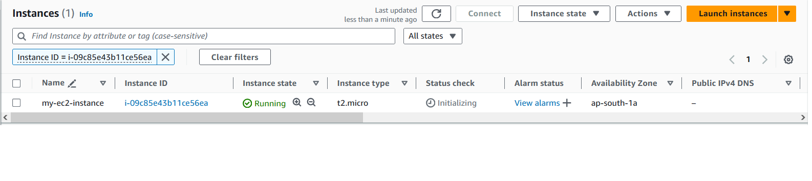      
